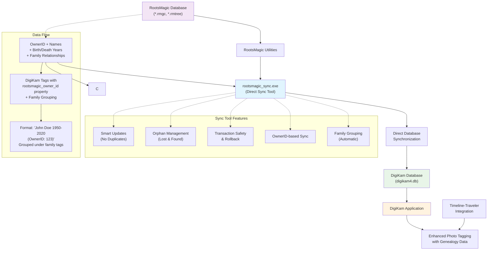

A C++ utility suite designed to work with RootsMagic genealogy database files, specifically focusing on extracting and processing data for integration with other applications. 

This project includes the main utility:
**rootsmagic_sync.exe** - Directly synchronizes RootsMagic people with DigiKam tags, handling updates and orphaned entries

The utility maintains references back to the original RootsMagic OwnerID of each person as a property of that tag and implements intelligent family-based tag organization. 
This is a key concept in a patent application I filed in 2008 titled "Face and subject tagging with relationship indexing in files to enhance organization and usability" US20090119608A1.
This integration enables projects such as Timeline-Traveler to enrich family history with thumbnails and full photos, creating a bridge between RootsMagic genealogical data 
and DigiKam's digital photo collections.

## Architecture Overview



### Workflow Explanation

1. **Data Source**: RootsMagic genealogy database contains family tree data with unique OwnerIDs for each person
2. **Processing**: Utility extracts person data (names, birth/death years, OwnerIDs) and family relationships
3. **Integration**: Data is transformed into DigiKam tags with genealogy metadata preserved and intelligent family grouping
4. **Enhancement**: Photos in DigiKam can now be tagged with specific family members, organized by family units
5. **Extension**: Timeline-Traveler and other projects can leverage this rich tagging for enhanced features

### Key Benefits

- **Unique Identification**: Each person tag includes RootsMagic's OwnerID for precise matching
- **Smart Synchronization**: Changes in RootsMagic automatically update DigiKam tags
- **Data Preservation**: Orphaned entries are moved to "Lost & Found" rather than deleted
- **Safety Features**: Transaction rollback protects your databases from partial updates
- **Family Grouping**: Automatic organization of people into family-based tag hierarchies for enhanced photo tagging efficiency 

## Family Grouping Feature

### Overview
The utility automatically organizes people into family-based tag hierarchies within DigiKam, making it much easier to tag photos across your extended family. Instead of having all people as direct children of the RootsMagic tag, the system creates family groups that reflect the actual family structure from your genealogy data.

### How It Works
1. **Family Detection**: The tool queries RootsMagic's `FamilyTable` and `ChildTable` to identify family relationships
2. **Family Tag Creation**: For each family, a tag is created with the format: `"{Father full name} (OwnerID: xxx) and {Mother full name} (OwnerID: xxx) Family (FamilyID: xxx)"`
3. **Person Organization**: Each person is automatically placed under their family tag instead of directly under the RootsMagic tag
4. **Smart Handling**: People without identified parents remain under the RootsMagic parent tag

### Examples
- **Complete Family**: "David Scott Huskey (OwnerID: 123) and Edith Marie Johnson (OwnerID: 456) Family (FamilyID: 8)" containing Scott, Sarah, and other children
- **Missing Father**: "unknown and Edith Marie Johnson (OwnerID: 456) Family (FamilyID: 8)" when father information is unavailable
- **Missing Mother**: "David Scott Huskey (OwnerID: 123) and unknown Family (FamilyID: 8)" when mother information is unavailable
- **No Parents**: Individual remains directly under "RootsMagic" tag

### Benefits for Photo Tagging
- **Faster Tagging**: Quickly find and tag all family members in group photos
- **Logical Organization**: Tags are organized the same way you think about family relationships
- **Extended Family Support**: Easy to tag photos from family reunions, weddings, and other multi-family events
- **Automatic Updates**: Family structure changes in RootsMagic are automatically reflected in DigiKam

## How to Use

### Prerequisites
- Windows operating system
- RootsMagic genealogy database file
- DigiKam photo management software

### Installation Steps
1. Download and set up SQLite tools:
   ```powershell
   .\download_sqlite.ps1
   ```
2. (Optional) Add SQLite to your system PATH:
   ```powershell
   .\add_sqlite_to_path.ps1
   ```

### Using the Utilities

1. Build both utilities:
   ```powershell
   .\build_and_deploy.ps1
   ```

#### Option 1: SQL Export Tool (rootsmagic_utils.exe)
Use this for manual control or when you want to review the SQL before importing:

2. Generate SQL script:
   ```powershell
   rootsmagic_utils.exe -d "path/to/your/rootsmagic.rmgc" [-o "output.sql"] [-p "parent_tag_name"]
   ```
   Parameters:
   - `-d` or `--database`: (Required) Path to your RootsMagic database file
   - `-o` or `--output`: (Optional) Path where the output SQL file should be saved (defaults to "tags.sql")
   - `-p` or `--parent-tag`: (Optional) Parent tag name for the imported RootsMagic names (defaults to "RootsMagic")

#### Option 2: Direct Sync Tool (rootsmagic_sync.exe) - **RECOMMENDED**
Use this for automatic synchronization that handles updates and orphaned entries:

2. Synchronize directly:
   ```powershell
   rootsmagic_sync.exe -r "path/to/your/rootsmagic.rmgc" -d "path/to/digikam4.db" [-p "parent_tag_name"] [-l "lost_found_tag_name"]
   ```
   Parameters:
   - `-r` or `--rootsmagic`: (Required) Path to your RootsMagic database file
   - `-d` or `--digikam`: (Required) Path to your DigiKam database file
   - `-p` or `--parent-tag`: (Optional) Parent tag name for RootsMagic tags (defaults to "RootsMagic")
   - `-l` or `--lost-found`: (Optional) Tag name for orphaned entries (defaults to "Lost & Found")

### For SQL Export Tool Only - Importing Tags into DigiKam
**Note: Skip this section if using the Direct Sync Tool (rootsmagic_sync.exe)**

1. Close DigiKam completely
2. Locate your DigiKam database file (digikam4.db):
   - Windows: Usually in `%LOCALAPPDATA%/digikam/digikam4.db`
   - Linux: Usually in `~/.local/share/digikam/digikam4.db`
   - macOS: Usually in `~/Library/Application Support/digikam/digikam4.db`
3. **IMPORTANT**: Make a backup of your digikam4.db file
4. Import the tags using SQLite:
   ```powershell
   sqlite3 "path/to/digikam4.db" ".read path/to/your/generated/tags.sql"
   ```
5. Start DigiKam and verify the tags were imported correctly

### Advantages of the Direct Sync Tool

The **rootsmagic_sync.exe** tool offers several benefits over the SQL export approach:

- **Smart Updates**: Changes to names or dates in RootsMagic are properly updated in DigiKam (no duplicates)
- **Orphan Management**: People removed from RootsMagic are moved to a "Lost & Found" tag instead of being deleted
- **Transaction Safety**: All operations are wrapped in transactions with automatic rollback on failure
- **Real-time Feedback**: Shows progress and statistics during synchronization
- **OwnerID-based Sync**: Uses RootsMagic's unique OwnerID for proper identification, not just names
- **Family Grouping**: Automatic organization of people into family-based hierarchies for enhanced photo tagging efficiency

### Troubleshooting
- **For SQL Export Tool**: If you encounter errors during import, restore your database from a manual backup
- **For Direct Sync Tool**: The tool uses transactions and will automatically rollback on any error
- Check for any special characters in tag names that might be causing issues
- Ensure the paths to both databases are correct and accessible
- **Close DigiKam completely** before running either tool
- Both tools use transactions, so operations are all-or-nothing, protecting your database from partial imports

### Switching between DigiKam databases
- To switch between digiKam databases, in DigiKam: Navigate to Settings -> Configure digiKam... -> Database and select the desired database from the dropdown list according to the digiKam manual.
